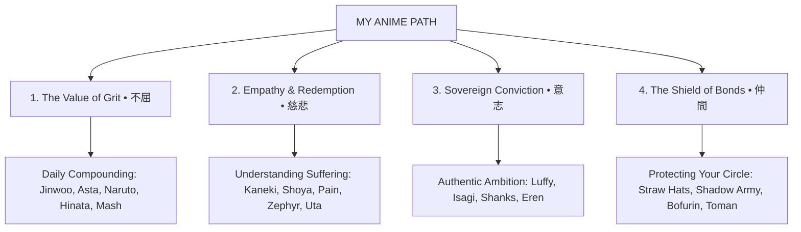

<div align="center">

# 私のアニメ道 • MY ANIME PATH
### *A Curated Archive of Legendary Anime Sagas, Cinema & Life Philosophy*

[](https://vercel.com)
[](https://developer.mozilla.org/en-US/docs/Web/HTML)
[](https://developer.mozilla.org/en-US/docs/Web/CSS)
[](https://developer.mozilla.org/en-US/docs/Web/JavaScript)
[](LICENSE)

<p align="center">
  <b>Explore over 32+ legendary anime masterpieces, theatrical cinema, and core philosophical takeaways distilled from iconic characters.</b>
</p>

[Live Demo](#deployment--hosting) • [Key Features](#key-features) • [Featured Sagas](#featured-anime-sagas--cinema) • [Getting Started](#getting-started)

---

</div>

## 📖 Overview

**MY ANIME PATH (私のアニメ道)** is a modern, performance-driven web showcase designed to document, celebrate, and distill life wisdom from over **32+ legendary anime sagas and cinema masterworks** spanning **5,900+ episodes**. 

Rather than functioning simply as an episode log, each entry captures:
1. **The Hero’s Core Philosophy**: Growth through grit, empathy in suffering, and sovereign ambition.
2. **Personal Narrative Reflection**: Deep qualitative insights on key character moments.
3. **Core Actionable Takeaways**: 3 distilled principles applicable to real-life discipline and personal growth.

---

## ✨ Key Features

- **⚡ Zero-Dependency, Lightweight Architecture**: Built with semantic HTML5, modern vanilla CSS3 (CSS Variables, Flexbox, CSS Grid), and lightweight JavaScript.
- **🌸 Sakura Particle Physics Engine**: Custom HTML5 Canvas rendering floating cherry blossom petals with interactive physics and subtle depth.
- **🔍 Real-Time Filter & Instant Search**: Instant category categorization (*One Piece Movies, Solo Leveling, Shonen & Grit, Sports & Ego, Psychological, Adventure & Comedy*) with live search and dynamic match counter.
- **💬 Dynamic 29-Quote Rotator**: Context-driven quote banner cycling through iconic character mantras with smooth opacity transitions.
- **📱 Responsive & Glassmorphic UI**: Tailored for desktops, tablets, and smartphones with glowing cyberpunk/anime accents, custom scrollbars, and back-to-top floating controls.
- **🚀 Ready for Vercel Deployment**: Pre-configured `vercel.json` with clean URL routing enabled out-of-the-box.

---

## ⛩️ The 4 Pillars of Anime Wisdom (四大哲学)

The platform distills anime storytelling into four foundational pillars:



---

## 🎬 Featured Anime Sagas & Cinema

<details>
<summary><b>Click to expand the full catalog (32+ Masterworks)</b></summary>
<br>

| # | Anime Title | Genre / Focus | Iconic Protagonist |
|---|---|---|---|
| 1 | **Solo Leveling** | Hunter / Dungeon System | *Sung Jinwoo* |
| 2 | **One Piece: Film Red** | Theatrical Film / Music | *Red-Haired Shanks & Uta* |
| 3 | **One Piece: Stampede** | Theatrical Film / Alliance | *Monkey D. Luffy* |
| 4 | **One Piece: Film Gold** | Theatrical Film / Liberty | *Monkey D. Luffy & Nami* |
| 5 | **One Piece: Film Z** | Theatrical Film / Conviction | *Former Admiral Zephyr & Kuzan* |
| 6 | **One Piece: Strong World** | Theatrical Film / Loyalty | *Straw Hat Pirates* |
| 7 | **One Piece: Baron Omatsuri** | Dark Cinema / Loss | *Monkey D. Luffy* |
| 8 | **Naruto (Original)** | Classic Shonen / Will of Fire | *Naruto Uzumaki & Rock Lee* |
| 9 | **Naruto Shippuden** | Drama / Vengeance & Peace | *Pain, Itachi & Naruto* |
| 10 | **One Piece (Main Series)** | Adventure / Inherited Will | *Straw Hat Grand Fleet* |
| 11 | **Black Clover** | Shonen / Limit Breaking | *Asta & Yami Sukehiro* |
| 12 | **Tokyo Ghoul** | Dark Seinen / Identity | *Ken Kaneki* |
| 13 | **Tokyo Revengers** | Action Drama / Time Leap | *Takemichi Hanagaki* |
| 14 | **Wind Breaker** | Martial Arts / Community | *Haruka Sakura & Hajime Umemiya* |
| 15 | **Haikyu!!** | Sports / Evolution & Teamwork | *Shoyo Hinata & Tobio Kageyama* |
| 16 | **Blue Lock** | Sports / Egoism & Spatial IQ | *Yoichi Isagi & Ego Jinpachi* |
| 17 | **A Silent Voice** | Cinema / Empathy & Redemption | *Shoya Ishida & Shoko Nishimiya* |
| 18 | **High School DxD** | Supernatural Action / Loyalty | *Issei Hyoudou & Rias Gremory* |
| 19 | **Mashle: Magic & Muscles** | Comedy / Physical Discipline | *Mash Burnedead* |
| 20 | **Death Note** | Psychological Thriller | *Light Yagami & L Lawliet* |
| 21 | **Attack on Titan** | Dark Fantasy / Freedom | *Eren Yeager & Scout Regiment* |
| 22 | **Demon Slayer (Kimetsu no Yaiba)** | Shonen / Compassion | *Tanjiro Kamado & Kyojuro Rengoku* |
| 23 | **Hunter × Hunter (2011)** | Tactical Shonen / Morality | *Gon, Killua, Kurapika & Meruem* |
| 24 | **SPY × FAMILY** | Spy Comedy / Found Family | *Twilight / Loid Forger & Anya* |
| 25 | **Hell's Paradise (Jigokuraku)** | Dark Action / Devotion & Tao | *Gabimaru the Hollow & Sagiri* |
| 26 | **Zom 100: Bucket List of the Dead** | Adventure / Joie de Vivre | *Akira Tendo* |
| 27 | **Avatar: The Last Airbender** | Fantasy / Balance & Honor | *Aang, Zuko & Uncle Iroh* |
| 28 | **Pokémon** | Adventure / 25-Year Journey | *Ash Ketchum & Pikachu* |
| 29 | **Dragon Ball (Z, Super, Daima)** | Shonen Legend / Breaking Limits | *Son Goku & Vegeta* |
| 30 | **Fire Force** | Kinetic Action / Hero's Flame | *Shinra Kusakabe* |
| 31 | **Dr. STONE** | Sci-Fi / Cumulative Science | *Senku Ishigami* |
| 32 | **Chainsaw Man** | Visceral Seinen / Raw Longing | *Denji, Aki & Power* |
| 33 | **Dandadan** | Supernatural / Occult Kinship | *Momo Ayase & Okarun* |

</details>

---

## 📂 Project Structure

```bash
My-Anime-Path/
├── index.html          # Main application file (HTML, styles & scripts)
├── Anime List.html     # Mirrored production release
├── vercel.json         # Vercel deployment configuration
├── README.md           # Documentation & project overview
└── posters/            # High-resolution optimized anime artwork
    ├── attack_on_titan.jpg
    ├── avatar.jpg
    ├── black_clover.jpg
    ├── blue_lock.jpg
    ├── chainsaw_man.jpg
    ├── dandadan.jpg
    ├── death_note.jpg
    ├── demon_slayer.jpg
    ├── dr_stone.jpg
    ├── dragon_ball.jpg
    ├── fire_force.jpg
    ├── haikyu.jpg
    ├── hells_paradise.jpg
    ├── high_school_dxd.jpg
    ├── hunter_x_hunter.jpg
    ├── mashle.jpg
    ├── naruto.jpg
    ├── naruto_shippuden.jpg
    ├── one_piece.jpg
    ├── one_piece_baron_omatsuri.jpg
    ├── one_piece_film_gold.jpg
    ├── one_piece_film_red.jpg
    ├── one_piece_film_z.jpg
    ├── one_piece_stampede.jpg
    ├── one_piece_strong_world.jpg
    ├── pokemon.jpg
    ├── silent_voice.jpg
    ├── solo_leveling.jpg
    ├── spy_x_family.jpg
    ├── tokyo_ghoul.jpg
    ├── tokyo_revengers.jpg
    ├── wind_breaker.jpg
    └── zom_100.jpg
```

---

## 🛠️ Getting Started

### Prerequisites
No build steps, compilers, or package managers are required. Any modern web browser can run the project directly.

### Running Locally
1. **Clone the repository**:
   ```bash
   git clone https://github.com/TraceHanami/My-Anime-Path.git
   cd My-Anime-Path
   ```

2. **Serve locally**:
   Using Python:
   ```bash
   python3 -m http.server 3000
   ```
   Or using Node.js `serve`:
   ```bash
   npx serve .
   ```

3. **Open in browser**:
   Navigate to [http://localhost:3000](http://localhost:3000).

---

## 🚀 Deployment & Hosting

### Deploy with Vercel (Recommended)
1. Push your repository to GitHub.
2. Import the repository in [Vercel](https://vercel.com).
3. The included `vercel.json` configures clean static routing automatically with zero manual configuration needed.

---

## 📜 License

Distributed under the **MIT License**. See `LICENSE` for more information.

---

<div align="center">
  <sub>Built with passion for anime culture and lifelong discipline • <b>Live your own legend.</b></sub>
</div>
